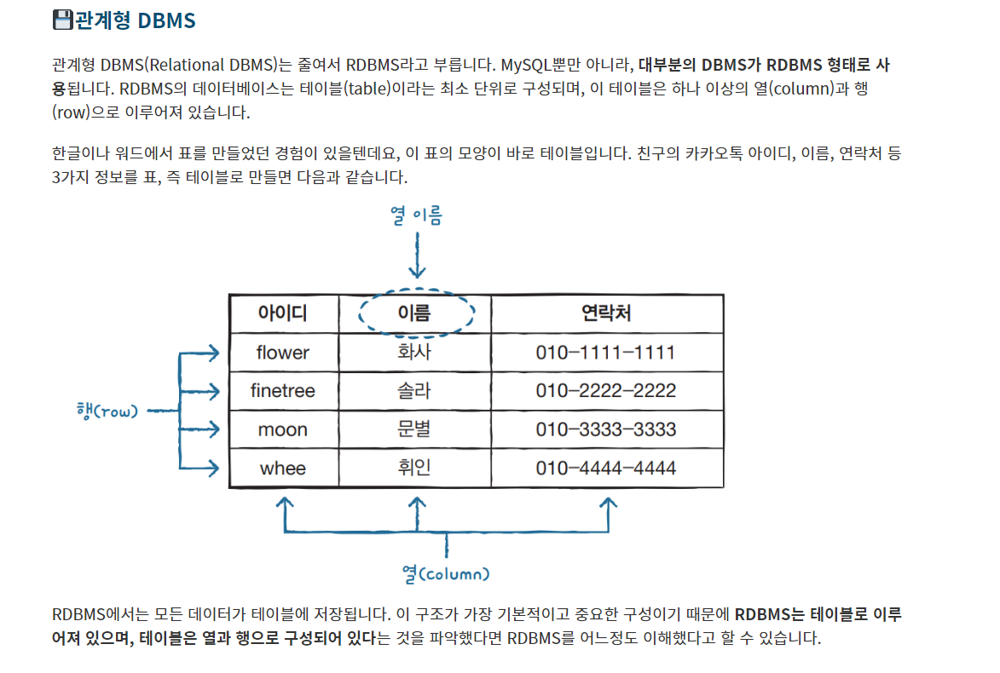

<!-- css -->

  <h3>데이터베이스 : 데이터를 저장하는 공간</h3>
  <h3>SQL : 중요하고도 방대한 데이터를 다루는데 사용되는 언어 데이터를 꺼내고 수정하고 삭제하기 위해서 SQL 사용</h3>
  <h3>관계형 DBMS</h3>
  
  <h3><strong>[DB]DDL,DML,DCL - 데이터베이스 언어</strong></h3>
  
<strong>데이터베이스 언어란?</strong>

  
데이터 베이스 언어는 데이터베이스를 구축하고 이용하기 위한 데이터베이스 시스템과의 통신 수단이다. DBMS를 통해 사용되며 기능과 사용 목적에 따라 DDL,DML,DCL로 구분된다.

  

    <h3>DDL(Data Definition Language) - 데이터 저장 언어</h3>
    
DDL은 데이터베이스를 정의하는 언어이며 데이터를 생성, 수정 삭제하는 등의 데이터의 전체 골격을 결정하는 역할을 한다. 스키마, 도메인, 테이블, 뷰, 인덱스 등을 정의하거나 변경,삭제할 때 사용된다.

    <table>
      <tr>
        <th>종류</th>
        <th>역할</th>
          <tr>
            <td>CREATE</td>
            <td>데이터베이스,테이블생성</td>
          </tr>
          <tr>
            <td>ALTER</td>
            <td>테이블 수정</td>
          </tr>
          <tr>
            <td>DROP</td>
            <td>데이터베이스, 테이블삭제(테이블복구불가!)</td>
          </tr>
          <tr>
            <td>TRUNCATE</td>
            <td>테이블초기화(테이블복구불가!)</td>
          </tr>
      </tr>
    </table>
  

  

    <h3><strong>DML(Data Manipulation Language) - 데이터 조작 언어</strong></h3>
    
DML은 <strong>데이터베이스에 입력된 레코드를 조회</strong>하거나 <strong>수정,삭제</strong> 등의 역할을 한다. 즉, 사용자로 하여금 데이터를 처리할 수 있게 하는 도구로서, 사용자와 DBMS간의 인터페이스를 제공한다.

    <table>
      <tr>
        <th>종류</th>
        <th>역할</th>
          <tr>
            <td>SELECT</td>
            <td>데이터 조회</td>
          </tr>
          <tr>
            <td>INSERT</td>
            <td>데이터 삽입</td>
          </tr>
          <tr>
            <td>UPDATE</td>
            <td>데이터 수정</td>
          </tr>
          <tr>
            <td>DELETE</td>
            <td>데이터 삭제</td>
          </tr>
      </tr>
    </table>
  

  

    <h3><strong>DCL(Data Control Language) - 데이터 제어 언어</strong></h3>
    
DCL은 무결성, 보안 및 권한 제어 회복 등의 역할을 한다. 주로 데이터를 보호하고 관리하기 위해 사용된다. DCL을 통해 불법적인 사용자로부터 데이터를 보호할 수 있고, 데이터 정확성을 위한 무결성을 유지할 수 있다, 또한 시스템 장애에 대비한 회복과 병행수행 제어가 가능하다.

    <table>
      <tr>
        <th>종류</th>
        <th>역할</th>
          <tr>
            <td>GRANT</td>
            <td>특정 사용자에게 특정 작업 수행권만 부여</td>
          </tr>
          <tr>
            <td>REVOKE</td>
            <td>특정 사용자에게 특정 작업 수행권한 박탈, 회수</td>
          </tr>
          <tr>
            <td>COMMIT (TCL이라고하여 트랜잭션을 제어하는 명령어라고 부분뒤에 표현되기도함)</td>
            <td>트랜잭션 작업 결과 반영</td>
          </tr>
          <tr>
            <td>ROLLBACK (TCL이라고하여 트랜잭션을 제어하는 명령어라고 부분뒤에 표현되기도함)</td>
            <td>트랜잭션 작업 취소 및 복구</td>
          </tr>
      </tr>
    </table>
  

  

    <h3><strong>TCL (Transaction Control Language)</strong></h3>
    
TCL은 DCL과 유사하지만, data를 제어하는 것이 아닌 transaction을 제어하기 위해 사용된다.

    
<strong>트랜잭션 (Transaction)</strong> : 밀접히 관련되어 분리할 수 없는 1개 이상의 DB를 조작하는 논리적 연산 단위를 의미한다. (예를 들어 게시판에 글을 작성하는 작업을 예로 들면, 게시판에 글을 업로드 하기 위해서는 게시글 작성(insert) 및 작성된 게시들을 게시판에서 조회(select) 등의 작업을 수행해야 하고, 이렇게 select + insert 문의 수행을 합쳐 트랜잭션(transaction)이라는 하나의 작업 단위로 부릅니다.)

    
TCL 명령어로는 <strong>COMMIT</strong> (올바르게 반영된 data를 DB에 반영), <strong>ROLLBACK</strong>(commit되지 않은 모든 transaction 수행 이전으로 되돌림)등이 있습니다.

    <h3>트랜잭션의 특징</h3>
    
1.원자성(Atomicity): 트랜잭션에 정의된 연산들은 모두 성공적으로 실행되거나 전혀 실행되지 않아야한다.

    
2.일관성(Consistency) : 트랜잭션 실행 전 DB의 내용이 잘못되지 않으면, 실행후에도 잘못되지 않아야 한다.

    
3.고립성(Isolation) : 트랜잭션 실행 도중에는 다른 트랜잭션의 영향을 받으면 안된다.

    
4.지속성(Durability) : 트랜잭션이 성공적으로 수행되면,DB의 내용은 영구적으로 저장된다.

  

  <h2>데이터베이스 CRUD란?</h2>
  
CRUD는 <strong class="red_txt">C</strong>REATE, <strong class="red_txt">R</strong>EAD, <strong class="red_txt">U</strong>PDATE, <strong class="red_txt">D</strong>ELETE

  
그럼 CRUD는 무엇인지? SQL에서는 무엇인지 표에서 정리해보자!

  <table>
    <tr>
      <th>이름</th>
      <th>조작</th>
      <th>SQL</th>
    </tr>
    <tr>
      <td><strong class="red_txt">C</strong>REATE</td>
      <td>생성</td>
      <td>INSERT</td>
    </tr>
    <tr>
      <td><strong class="red_txt">R</strong>EAD</td>
      <td>읽기</td>
      <td>SELECT</td>
    </tr>
    <tr>
      <td><strong class="red_txt">U</strong>PDATE</td>
      <td>수정</td>
      <td>UPDATE</td>
    </tr>
    <tr>
      <td><strong class="red_txt">D</strong>ELETE</td>
      <td>삭제</td>
      <td>DELETE</td>
    </tr>
  </table>

<!-- script -->

