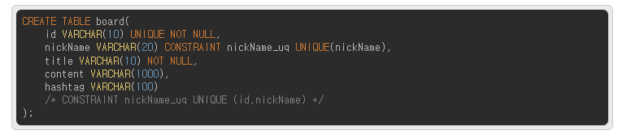
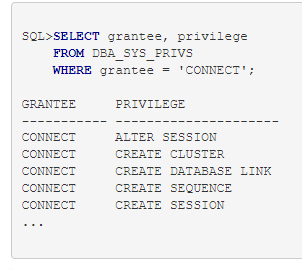

# 데이터베이스구현_서술형문제_정리
<!-- css -->
<!--  -->

  <h1>1.DBMS(Data Base Management System)에 대해 서술하시오.</h1>
  
데이터베이스를 '데이터의 집합'이라고 정의한다면 이런 <strong>데이터베이스를 관리하고 운영하는 소프트웨어를  DBMS(Database Management System)</strong>라고 합니다. 다양한 데이터가 저장되어 있는 데이터베이스는 여러 명의 사용자나 응용 프로그램과 공유  하고 동시에 접근이 가능해야 합니다.

  

  <h1>2.데이터베이스 관리자 계정과 사용자 계정에 대해 서술하시오.</h1>
  <h3>데이터 베이스 사용자 계정</h3>
  
데이터 베이스의 생성 및 관리, 데이터의 삽입,수정,변경 및 삭제를 수행하는 데이터베이스 계정을 의미한다. DBMS 소프트웨어의 설치 및 관리에 사용할 계정을 의미하며 보통 설치 계정과 일반적인 운영 계정을 분리할 궛을 권장한다.

  <ul>
    <li><strong>관리자 계정(Administrator)</strong></li>
    <li><strong>DBMS 설치 계정(Administrator)</strong></li>
    <li><strong>일반 계정(End user)</strong></li>
  </ul>
  <h3>관리자 계정(Administrator)</h3>
  <ul>
    <li>데이터베이스의 생성과 관리를 담당하는 슈퍼 유저(Super User)계정이며, 정의, 생성, 삭제 등의 작업이 가능합니다.</li>
    <li>오라클 데이터베이스 관리자 계정인 SYS와 SYSTEM 계정이 자동으로 생성되어 있다. MySQL 데이터베이스인 경우에는 관리자 계정인 root가 기본적으로 생성된다.</li>
    <li>오브젝트(Object)의 생성, 변경, 삭제 등의 작업이 가능하다.</li>
    <li>데이터베이스에 대한 모든 권한과 책임을 가지는 계정입니다.</li>
  </ul>
  <h3>DBMS 설치 계정(Administrator)</h3>
  <ul>
    <li>DBMS 소프트웨어의 소유자가 되며, 사용자 계정과 그룹을 가집니다</li>
    <li>DBMS 제품군에 따라 계정을 분리합니다.</li>
    <li>설치된 DBMS 백업은 이 계정으로 작업해야 합니다.</li>
  </ul>
  <h3>일반 계정(End user)</h3>
  <ul>
    <li>데이터베이스에 대하여 질의(Query), 갱신, 보고서 작성 등의 작업을 수행할 수 있는 계정</li>
    <li>일반 계정은 업무에 필요한 최소한의 권한만 가지는 것을 원칙으로 합니다.</li>
  </ul>
  <h4>SYS 계정</h4>
  
데이터베이스내의 모든 권한을 갖는 <u>최상위 레벨의 사용자</u>

  <h4>SYSTEM 계정</h4>
  
<u>1) SYS 사용자로부터 "DBA권한"을 받은 사용자</u>

  
2) 새로운 사용자를 추가, 변경 삭제할 수 있다.

  
3) 사용자별 공간할당, 패스워드관리, 세션관리 등을 할 수 있다.

  
4) 데이터베이스 오브젝트(테이블,뷰,트리거)는 "사용자별로" 생성된다.

  
5) 데이터베이스 오브젝트를 생성한 사용자를 그 오브젝트의 소유자(owner)라 한다.

  <h4>[사용자 생성]</h4>
  
dba권한을 가진 사용자만 가능하다.

  
형식 ) CREATE USER 사용자ID IDENTIFIED BY 패스워드

  <h4>[사용자 변경]</h4>
  
<strong>패스워드 변경</strong>

  
ALTER USER 사용자명 IDENTIFIED BY 바꿀비밀번호

  <h1>3.제약조건 중 NOT NULL, UNIQUE 제약조건에 대해 서술하시오.</h1>
  <h3>💡 [NOT NULL 제약조건]</h3>
  
테이블을 만들 대 컬럼을 정의하는데, 만약 그때 NOT NULL 제약조건을 명시하게 되면 해당 컬럼에서는 반드시 데이터를 입력해야만 한다. 이러한 제약조건 특성상 해당 컬럼에는 반드시, 필수적으로 값이 들어가야 한다면 NOT NULL 명시해서 사용해 주는 것이 안전하다.

  

    <h4>NOT NULL 제약조건 추가</h4>
    

    
* 일반적으로 NOT NULL은 제약조건명을 굳이 명시하지 않고 그냥 타입 옆에 NOT NULL을 명시하는 것만으로 끝내는 경우가 많다. 그리고 추가적으로 나중에 제약조건을 추가하는 방법은 다음과 같다.

    

    <h4>NOT NULL 제약조건 삭제</h4>
    

    
이런식으로 NOT NULL 제약조건을 삭제해 주면 된다.

    
NULL값 허용이라는 것은 굳이 명시하지 않기 때문에 NOT NULL 제약조건을 제거할 때만 NULL이라고 명시해서 제거 해주는 역할을 한다.

  

  

    <h3>💡 [UNIQUE 제약조건]</h3>
    
유니크란 고유값을 의미한다.   즉, <strong>유일한 값만 들어가도록 하고 싶을 때 사용하는 제약조건</strong>이다.  그리고 당연하게도 NOT NULL과 함께 사용할 수 있다.

    
UNIQUE 제약조건을 추가하는 방법은 다음과 같다.

    

      
    

    
UNIQUE 제약조건은 NOT NULL과는 다르게 제약조건 명을 명시하게 되면 그 뒤에 컬럼명을 다시 한번 명시해야 한다.  그래서 굳이 해당 컬럼 옆에 명시하기보다는 끝나는 지점에 한 번에 묶어서 처리를 한다.

    

      
    

    
UNIQUE 제약조건을 많이 사용하지는 않지만,  그냥 기본키로는 설정하지 않지만 그 값의 고유성을 지켜주고 싶을 때 사용하는 제약조건이라 생각하면 된다.

    
그리고 <strong>UNIQUE 제약조건의 특징</strong>으로는 다음과 같다.

    <ul>
      <li>NOT NULL을 같이 사용하는 이유는 UNIQUE자체는 NULL을 허용하기 때문이다.</li>
      <li>UNIQUE로 선언된 컬럼은 FOREIGN KEY참조가 가능하다.</li>
    </ul>
  

  <h1>4.제약조건 중 PRIMARY KEY, FOREIGN KEY, CHECK, DEFAULT 에 대하여 서술하시오.</h1>
  

    <h3>💡 [PRIMARY KEY 제약조건]</h3>
    
어떤 테이블이든 거의 무조건 하나는 들어간다 생각되는 기본키이다!

    <ul>
      <li>기본키 역시 기본적으로 다른 제약조건과 마찬가지로 테이블을 생성할 때 같이 정의한다</li>
      <li>테이블당 하나만 정의 가능하다.(두개 이상의 기본키는 조합키/복합키 라고 불린다.)</li>
      <li>PK는 <strong style="color:#f89009">NOT NULL + UNIQUE</strong>의 기능을 가지고 있다.</li>
      <li>주키 / 기본키 / 식별자 등 다양한 명칭으로 불린다.</li>
      <li>자동 INDEX가 생성되는데, 이는 검색키로써 검색 속도를 향상시키는 역할을 한다.</li>
    </ul>
    

      
    

    

      
    

    
이런식으로 기본키를 추가해주고는 하는데,  보통 PK나 FK 같은 경우는 컬러명 옆에 바로 명시하지는 않고 마지막에 CONSTRAINT를 사용하여 한번에 선언한다.  조합키나 복합킨를 사용할 경우에는 컬럼명을 여러개 명시해주면 된다.

    

      
    

  

  

    <h3>💡 [FOREIGN KEY 제약조건]</h3>
    
외래키도 역시 PK와 똑같이 매우 중요한 제약조건이다.

    <ul>
      <li>외부키, 외래키, 참조키, 외부 식별자 등으로 불리며 흔히 FK라고도 한다.</li>
      <li>FK가 정의된 테이블을 자식 테이블이라고 칭한다.</li>
      <li>참조되는 테이블 즉, PK가 있는 테이블을 부모 테이블이라 한다.</li>
      <li>부모 테이블의 PK 컬럼에 존재하는 데이터만 자식 테이블에 입력할 수 있다.</li>
      <li>부모 테이블은 자식의 데이터나 테이블이 삭제된다고 영향을 받지 않는다.</li>
      <li>참조하는 데이터 컬럼과 데이터 타입이 반드시 일치해야 한다.</li>
      <li>조할 수 있는 컬럼은 기본키(PK)나 UNIQUE만 가능하다.(보통 PK랑 엮는다.)</li>
    </ul>
    

      
    

    
참조할 컬럼과 같은 컬럼이 자식 테이블에 존재해야만 한다.  (굳이 같은 이름을 가진 컬럼일 필요는 없지만 일반적으로는 같은 이름을 가진 컬럼을 선언한다.)  그리고 참조되는 컬럼에 데이터가 먼저 있어야 하기 때문에 자식 테이블에 먼저 값을 넣을 수는 없다.

    
그리고 특이하게 FK를 선언할 때 사용되는 두 가지 옵션이 존재한다.

    <h3>ON DELETE CASCADE (많이사용됨. 이옵션을 사용하지 않으면 엮여있는 모든 자식테이블의 값을 먼저 다 지워줘야하기때문에.)</h3>
    
참조되는 부모 테이블 행에 대한 DELETE를 허용한다.  즉, 참조되는 부모 테이블 값이 삭제되면 연쇄적으로 자식 테이블 값 역시 삭제된다는 의미이다.

    <h3>ON DELETE SET NULL</h3>
    
참조되는 부모 테이블 행에 대한 DELETE를 허용한다.  이건 CASCADE와는 다른데, 부모 테이블의 값이 삭제되면 해당 참조하는 자식 테이블의 값들이 NULL로 설정되는 옵션이다.

  

  

    <h3>💡 [CHECK 제약조건]</h3>
    
<strong style="color:#f89009">CHECK은 입력할 수 있는 값의 범위를 설정해주는 제약조건</strong>이다.  그렇기 때문에 다음과 같은 특징을 가지고 있다.

    <ul>
      <li>입력 값이 조건에 맞지 않으면 오류가 발생한다.</li>
      <li>입력 값의 범위를 지정할 수 있다.</li>
    </ul>
    
예를들어 2000 ~ 10000 까지만 입력이 가능하다고 설정을 하게 되면 그 범위를 벗어난 값이 들어올 수 없다는 말이다.  그리고 주의할 점은 여느 제약조건과 마찬가지로 이미 들어가 있는 데이터가 조건에 위반되면 제약조건을 추가할 수 없다.

    

      
    

  

  

    <h3>💡 [DEFAULT 제약조건]</h3>
    
DEFAULT는 아무 값도 입력하지 않아도 NULL 값이 아닌,  <strong style="color:#f89009">기본 값으로 설정한 값이 자동으로 입력되도록 하는 제약조건이다.</strong>  NOU NULL과 마찬가지로 굉장히 많이 사용되는 제약조건이다.

    

      
    

  

  <h1>5.데이터 오브젝트를 정의하기 위한 DDL(Data Definition Language)에 대해 서술하시오.</h1>
  

    <h3>DDL(Data Definition Language) - 데이터 저장 언어</h3>
    
DDL은 데이터베이스를 정의하는 언어이며 데이터를 생성, 수정 삭제하는 등의 데이터의 전체 골격을 결정하는 역할을 한다. 스키마, 도메인, 테이블, 뷰, 인덱스 등을 정의하거나 변경,삭제할 때 사용된다.

    <table>
      <tr>
        <th>종류</th>
        <th>역할</th>
          <tr>
            <td>CREATE</td>
            <td>데이터베이스,테이블생성</td>
          </tr>
          <tr>
            <td>ALTER</td>
            <td>테이블 수정</td>
          </tr>
          <tr>
            <td>DROP</td>
            <td>데이터베이스, 테이블삭제(테이블복구불가!)</td>
          </tr>
          <tr>
            <td>TRUNCATE</td>
            <td>테이블초기화(테이블복구불가!)</td>
          </tr>
      </tr>
    </table>
  

  <h1>6.외래키 제약조건 설정 시 사용하는 ON DELETE CASCADE, ON DELETE SET NULL 옵션에 대해 서술하시오.</h1>
  
외래키(Foreign Key) 삭제옵션으로 다음과같은 값들이 있다.

  <ol>
    <li>ON DELETE CASCADE : PARENT 삭제 시 CHILD 같이 삭제</li>
    <li>ON DELETE SET NULL: PARENT 삭제 시 CHILD의 해당 필드 NULL로 업데이트</li>
    <li>ON DELETE SET DEFAULT : PARENT 삭제 시 CHILD의 해당 필드 DEFAULT 값으로 UPDATE</li>
    <li>ON DELETE RESTRICT : CHILD 테이블에 PK 값이 없는 경우만 PARENT 삭제 <strong>(DEFAULT값!) 기본삭제옵션</strong></li>
    <li>ON DELETE NO ACTION : 참조 무결성 제약조건을 위배하는 액션은 불가</li>
  </ol>

  <h1>7.오라클 계정의 권한 설정 ROLE중 CONNECT, RESOURCE에 대해 서술하시오.</h1>
  
오라클 데이터베이스를 생성하면 기본적으로 몇 가지의 ROLE이 생성된다. DBA_ROLES 데이터 사전을 통하여 미리 정의된 ROLE을 조회 할 수 있다.

  

    
  

  

    <h3>CONNECT ROLE</h3>
    <ul>
      <li>오라클에 접속할 수 있는 세션 생성 및 테이블을 생성하거나 조회할 수 있는 가장 일반적인 권한들로 이루어져 있다.</li>
      <li>CONNECT ROLE이 없으면 유저를 생성하고서도 Oracle에 접속 할 수가 없다.</li>
      <li>아래의 명령어로 CONNECT ROLE이 어떤 권한으로 이루어져 있는지 확인 할 수 있다.</li>
    </ul>
    

      
    

  

  

    <h3>RESOURCE ROLE</h3>
    <ul>
      <li>Store Procedure나 Trigger와 같은 PL/SQL을 사용할 수 있는 권한 들로 이루어져 있다.</li>
      <li>PL/SQL을 사용하려면 RESOURCE ROLE을 부여해야 한다.</li>
      <li>유저를 생성하면 일반적으로 CONNECT, RESOURCE롤을 부여 한다.</li>
    </ul>
  

  

    <h3>DBA ROLE</h3>
    <ul>
      <li>모든 시스템 권한이 부여된 ROLE 이다.</li>
      <li>DBA ROLE은 데이터베이스 관리자에게만 부여해야 한다.</li>
    </ul>
  

