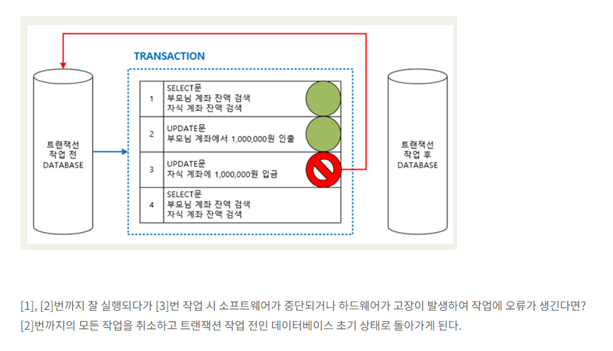
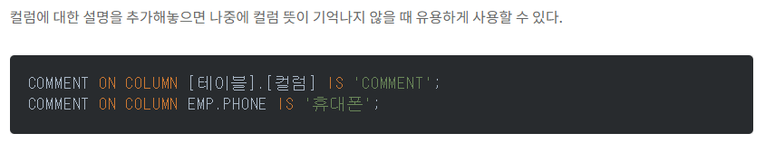

# SQL활용_서술형문제_정리

  <h2>1. SQL (Structured Query Language)에 대하여 서술하시오</h2>
  
<strong>구조적 쿼리 언어(SQL)</strong>은 관계형 데이터베이스에 정보를 저장하고 처리하기 위한 프로그래밍 언어이다. 관계형 데이터베이스는 정보를 표 형식으로 저장하며, 행과 열은 다양한 데이터 속성과 데이터 값 간의 다양한 관계를 나타낸다. SQL문을 사용하여 데이터 베이스에서 정보를 저장, 업데이트, 제거, 검색 및 검색할 수 있다. 데이터베이스 성능을 유지 관리하고 최적화 하는데 SQL을 사용 할 수도 있다.

  <h2>2, DCL (Data Control Language)에 대하여 예를 들어 서술하시오.</h2>
  <h4>ex) COMMIT, ROLLBACK, GRANT, REVOKE</h4>
  
DCL은 데이터의 보안,무결성,회복,병행 수행 등을 정의하는데 사용되는언어

  <h2>2_1, DDL (Data Definition Language)에 대하여 예를 들어 서술하시오.</h2>
  <h4>ex) CREATE, ALTER, DROP</h4>
  
DDL은 SCHEMA, DOMAIN, TABLE, VIEW , INDEX를 정의하거나 변경 또는 삭제할 때 사용하는 언어이다.

  
논리적 데이터 구조와 물리적 데이터 구조의 사상을 정의한다.

  
데이터베이스 관리자나 데이터베이스 설계자가 사용

  <h2>3. DML (Data Manipulation Language)에 대하여 예를 들어 서술하시오.</h2>
  <h4>ex) SELECT, INSERT, DELETE, UPDATE</h4>
  
DML은 데이터베이스에 저장된 데이터를 질의어를 통해 처리하는 언어이다.

  
데이터베이스의 사용자와 데이터베이스 관리 시스템 간의 인터페이스를 제공한다.

  <h2>4. 트랜잭션 (Transaction)에 대하여 예를 들어 서술하시오.</h2>
  <h4>트랜잭션이란 "거래"라는 뜻으로 데이터베이스 내에서 하나의 그룹으로 처리되어야 하는 명령문들을 모아 놓은 논리적인 작업 단위이다.</h4>
  <h5>트랜잭션의 특징</h5>
  <ul>
    <li>원자성(Atomicity)</li>
    <li>일관성(Consistency)</li>
    <li>독립성(Isolation)</li>
    <li>지속성(Durability)</li>
  </ul>
  

    
  

  

    
  

  <h2>5. TCL (Transaction Control Language)에 해당되는 구문들을 3가지 적고 설명하시오.</h2>
  <table>
      <tr>
        <th>명령어</th>
        <th>내용</th>
          <tr>
            <td>COMMIT</td>
            <td>모든 작업을 정상적으로 처리하겠다는 명령어</td>
          </tr>
          <tr>
            <td>ROLLBACK</td>
            <td>	모든 작업을 다시 돌려 놓겠다는 명령어</td>
          </tr>
          <tr>
            <td>SAVEPOINT</td>
            <td>Commit 전에 특정 시점까지만 반영하거나 Rollback하겠다는 명령어</td>
          </tr>
      </tr>
    </table>

  <h2>6. 데이터 딕셔너리 (Data Dictionary)에 대하여 서술하시오.</h2>
  <h3>데이터 딕셔너리 뷰의 종류</h3>
  
1.USER_XXXX : 자신의 계정이 소유한 객체 등에 관한 정보를 조회함.</ㅎ>
  
2.ALL_XXXX : 자신의 계정이 소유한 객체 등에 관한 정보를 조회함.(권한부여 받은것)

  
3.DBA_XXXX : 데이터베이스 관리자만 접근이 가능한 객체 등의 정보 조회

  
-- 데이터베이스 관리자는 SYS 계정과 SYSTEM

  
-- 데이터베이스 관리자는 DBA라고도함.

  
-- 데이터 분석 설계자도 있고 DA라고도함.

  <h2>7. Set Operator 중 UNION과 UNION ALL의 차이점과 INTERSECT, MINUS에 대하여 서술하시오.</h2>
  
[집합설명링크(합집합,교집합,차집합)](https://velog.io/@bining/%EA%B5%90%EC%A7%91%ED%95%A9-%EC%B0%A8%EC%A7%91%ED%95%A9-%ED%95%A9%EC%A7%91%ED%95%A9-%EC%95%8C%EA%B3%A0%EB%A6%AC%EC%A6%98)

  
<strong>UNION :</strong> 각 쿼리의 결과 합을 반환하는 합집합 (중복제거)

  

    
  

  
<strong>UNION ALL :</strong> 각 쿼리의 모든 결과를 포함한 합집합 (중복제거 안함)

  

      
  

  
<strong>INTERSECT :</strong> 두 개의 테이블에 대해 겹치는 부분을 추출하는 연산 관계형 대수의 일반 집합 연산에서 <em>교집합</em>의 역할. 추출 후에는 중복된 결과를 제거.  참고로 INTERSECT는 Oracle,Maria DB에서는 지원되지만, MYSQL에서는 지원되지 않음

  

      
  

  
<strong>MINUS(EXCEPT) :</strong> 관계형 대수의 일반 집합 연산에서 <em>차집합</em>의 역할. 두개의 테이블에서 겹치는 부분의 앞의 테이블에서 제외해서 추출하는 연산. 추출 후에는 중복된 결과를 제거. INTERSECT로 나온 결과물 만 빼준다고 생각해도됨.  참고로, MARIA DB에서는 10.3 버젼부터 지원, Oracle DB에서는 MINUS라는 이름으로 지원, MYSQUL에서는 지원안됨.

  

      
  

  <h2>8. SQL 구문 중 'ALTER' 구문은 어떤 종류의 SQL이고 역할은 무엇인지 서술하시오.</h2>
  <h4>ALTER구문</h4>
  
테이블 설계 후 변경사항이 있을 때 ALTER구문을 사용하는데, 드문드문 사용... 까먹으니 자주사용해보자...

  <ul>
    <li>ADD : 열 추가</li>
    

      
    

    <li>RENAME : 열 이름 변경</li>
    

      
    

    <li>MODIFY : 열 자료형 변경</li>
    

      
    

    <li>DROP : 열 삭제</li>
    

      
    

    <li>COMMENT ON : 테이블 컬럼 설명 추가</li>
    

      
    

  </ul>

  <h2>9. 뷰에 사용하는이유에 대해 설명하시오.</h2>
  <h4>뷰를 사용하는이유</h4>
  
1.공통모듈처럼 사용하기 위해서 (예를들어 뷰 하나에 생성해 놓으면 이 VIEW를 참조하는 어플리케이션 단에 있는 모든 query들을 수정을 하지 않고도 모드 query 수정 가능)

  
2.굉장히 복잡한 query를 생성했을 경우에는 소스 단에 있는 query가 매우 간결해 질 수 있다.

  
-- 중요한건 보안상의 이유로 뷰를 많이 사용함! (보안상으로 이슈가 되는 테이블을 연동을 하려고 할 때 VIEW로 생성을 해서 제공을 한다!)

  
----------------------------------------------------

  
 VIEW 계정내용  
    SHOW USER;  
    SELECT * FROM DBA_TABLES; => 시스템계정에서 실행해야함 (이거부터!!!!)  
    SELECT * FROM ALL_TABLES;  
    SELECT * FROM ALL_VIEWS;  
    GRANT CREATE VIEW TO IDOL_MEMBER;  
    SELECT * FROM USER_VIEWS;
  

